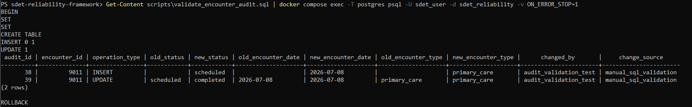
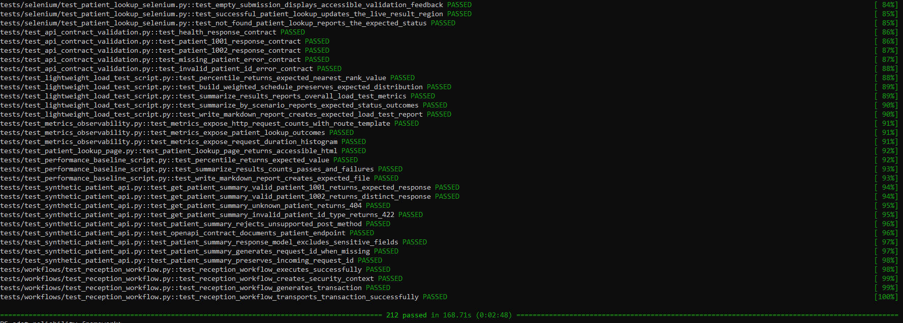
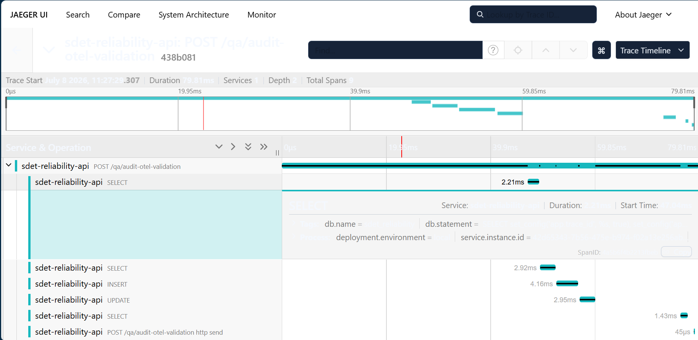

# PostgreSQL Audit Validation

## Purpose

This document explains how the SDET Reliability Framework validates PostgreSQL stored audit logic.

The goal is to prove that database-side changes to synthetic encounter records are captured in a repeatable, testable, and traceable way.

This supports reliability validation by showing that the system does not only return successful API responses, but also records database audit evidence.

---

## What This Validates

The audit validation flow proves that:

* An encounter insert creates an audit row.
* An encounter update creates an audit row.
* Old and new values are captured.
* Audit metadata is populated.
* Validation can run inside a transaction and roll back test data.
* Audit behavior can be tested manually and through pytest.
* OpenTelemetry trace identifiers can be stored in audit rows for runtime correlation.

---

## Components

* `encounters` — source table for synthetic encounter records.
* `encounter_audit` — audit table that records change history.
* `audit_encounter_changes()` — trigger function that detects insert, update, and delete changes.
* `write_encounter_audit()` — helper function that writes audit rows.
* `trg_audit_encounter_changes` — trigger attached to the `encounters` table.
* `scripts/validate_encounter_audit.sql` — manual SQL validation script.
* `tests/integration/test_encounter_audit_validation.py` — automated pytest validation.
* `POST /qa/audit-otel-validation` — local QA endpoint for audit and OpenTelemetry correlation.

---

## Audit Table Behavior

The `encounter_audit` table records old and new values for encounter changes.

Key fields include:

```text
encounter_id
patient_id
provider_id
facility_id
operation_type
old_status
new_status
old_encounter_date
new_encounter_date
old_encounter_type
new_encounter_type
changed_at
changed_by
change_source
trace_id
span_id
request_id
request_method
request_path
service_name
```

The `trace_id` and `span_id` fields allow audit rows to be correlated with OpenTelemetry traces.

---

## Manual SQL Validation

Manual validation script:

```text
scripts/validate_encounter_audit.sql
```

Run:

```powershell
Get-Content scripts\validate_encounter_audit.sql | docker compose exec -T postgres psql -U sdet_user -d sdet_reliability -v ON_ERROR_STOP=1
```

Expected result:

```text
operation_type | old_status | new_status
---------------+------------+------------
INSERT         |            | scheduled
UPDATE         | scheduled  | completed
```

The script ends with:

```sql
ROLLBACK;
```

This proves audit behavior without permanently inserting validation records.

---

## Screenshot: Manual Audit Validation

```markdown

```

<sub>Capture file: `docs/images/postgres-audit-query-by-trace-id.png`</sub>

<sub>The screenshot should show two audit rows, one `INSERT`, one `UPDATE`, old/new status values, and matching `trace_id` values if using the OpenTelemetry validation endpoint.</sub>

---

## Automated Audit Integration Test

Automated test:

```text
tests/integration/test_encounter_audit_validation.py
```

Run:

```powershell
python -m pytest tests/integration/test_encounter_audit_validation.py -v
```

This test runs the SQL validation script against the Docker Compose PostgreSQL service.

It verifies:

* SQL execution succeeds.
* One `INSERT` audit row is present.
* One `UPDATE` audit row is present.
* Expected status values are present.
* Audit metadata is present.
* The validation script rolls back after execution.

Because this is a Docker-backed integration test, it skips cleanly if the PostgreSQL Docker Compose service is unavailable.

---

## Screenshot: Automated Audit Test





<sub>Capture file: `docs/images/pytest-audit-integration-pass.png`</sub>

<sub>The screenshot should show `tests/integration/test_encounter_audit_validation.py` passing.</sub>

---

## API-Based Audit and Trace Validation

Local QA endpoint:

```text
POST /qa/audit-otel-validation
```

Run:

```powershell
$response = Invoke-RestMethod -Method Post http://localhost:8000/qa/audit-otel-validation
$response | ConvertTo-Json -Depth 6
```

Expected result:

```text
validation: passed
audit_row_count: 2
trace_id: populated
span_id: populated
audit_rows: INSERT and UPDATE
```

This endpoint:

1. Captures the active OpenTelemetry trace context.
2. Stores trace/request metadata in PostgreSQL transaction-local settings.
3. Inserts a synthetic encounter.
4. Updates the encounter from `scheduled` to `completed`.
5. Allows the PostgreSQL trigger to write audit rows.
6. Returns the audit rows in the API response.

---

## Screenshot: API Audit/OpenTelemetry Response

```markdown

```

<sub>Capture file: `docs/images/audit-otel-endpoint-response.png`</sub>

<sub>The screenshot should show `validation: passed`, a populated `trace_id`, a populated `span_id`, `audit_row_count: 2`, and both `INSERT` and `UPDATE` audit rows.</sub>

---

## Query Audit Rows by Trace ID

After running the API validation endpoint:

```powershell
$traceId = $response.trace_id
```

Query PostgreSQL:

```powershell
docker compose exec postgres psql -U sdet_user -d sdet_reliability -c "SELECT audit_id, encounter_id, operation_type, old_status, new_status, trace_id, span_id, request_method, request_path, service_name FROM encounter_audit WHERE trace_id = '$traceId' ORDER BY audit_id;"
```

Expected result:

```text
INSERT |           | scheduled  | same trace_id
UPDATE | scheduled | completed  | same trace_id
```

This proves that the runtime request trace and the database audit trail are correlated.

---

## Screenshot: Audit Rows by Trace ID

```markdown

```

<sub>Capture file: `docs/images/postgres-audit-query-by-trace-id.png`</sub>

<sub>The screenshot should show two audit rows with the same `trace_id`, `POST` as the request method, `/qa/audit-otel-validation` as the request path, and `sdet-reliability-api` as the service name.</sub>

---

## Reliability Value

A simple API test can prove that an endpoint returned `200 OK`.

This audit validation proves more:

```text
API request succeeded
  -> database insert occurred
  -> database update occurred
  -> trigger executed
  -> audit rows were written
  -> old and new values were captured
  -> trace_id was stored for correlation
```

That is stronger evidence of system reliability.

---

## Safety and Data Notes

This project uses synthetic data only.

Do not include real patient data, production credentials, protected health information, or sensitive identifiers in screenshots, traces, logs, or audit examples.

The local PostgreSQL credentials are for development only.
