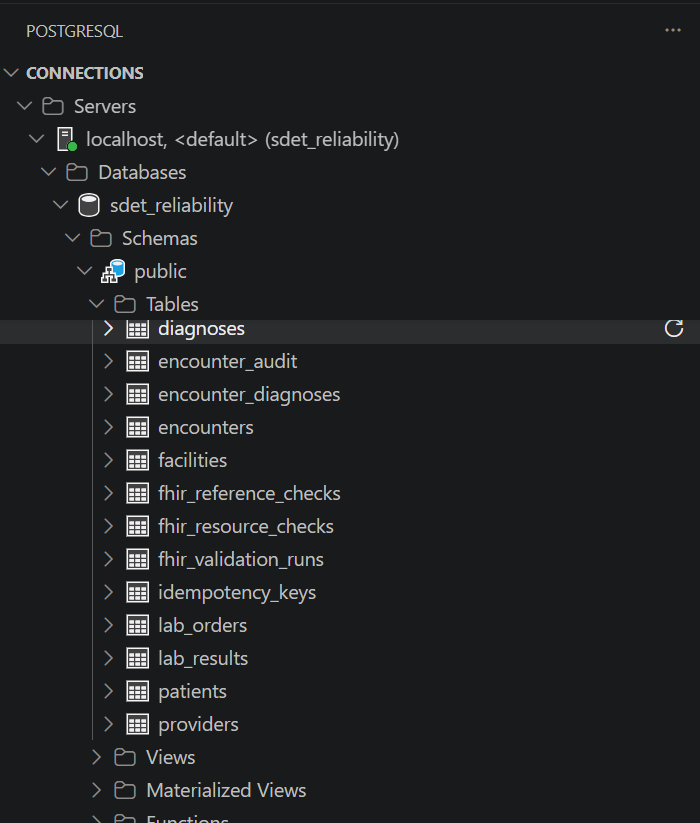
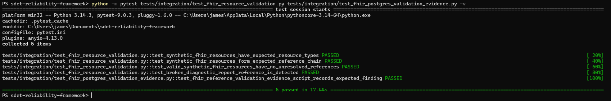
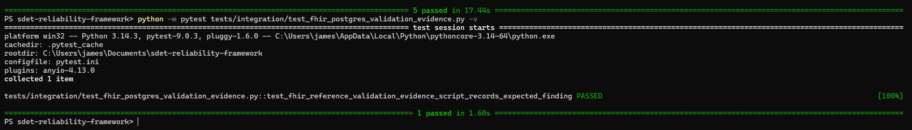

# FHIR PostgreSQL Validation Evidence

## Purpose

This document explains how the SDET Reliability Framework stores and validates PostgreSQL-backed evidence for synthetic FHIR-style reference validation.

The goal is to prove that FHIR validation results are not only checked in automated tests, but can also be represented as queryable database evidence.

This connects the healthcare interoperability module to the broader reliability framework.

---

## What This Adds

The FHIR module already validates:

```text
synthetic FHIR-style JSON resources
valid Patient, Encounter, Observation, and DiagnosticReport references
negative broken-reference detection
pytest-based automation
```

This PostgreSQL evidence layer adds:

```text
validation run tracking
resource-level check records
reference-level check records
queryable missing-reference findings
manual SQL validation evidence
automated pytest validation of the SQL evidence script
```

The project can now show both:

```text
test-level proof
database-level proof
```

---

## Schema Files

The PostgreSQL evidence schema is defined in:

```text
db/sql/009_fhir_reference_validation_evidence.sql
```

The validation evidence script is defined in:

```text
scripts/validate_fhir_reference_validation_evidence.sql
```

The automated pytest integration test is defined in:

```text
tests/integration/test_fhir_postgres_validation_evidence.py
```

---

## Evidence Tables

The schema creates three PostgreSQL tables:

```text
fhir_validation_runs
fhir_resource_checks
fhir_reference_checks
```

---

## fhir_validation_runs

The `fhir_validation_runs` table records one validation execution.

It stores:

```text
validation_run_id
run_name
scenario_name
run_status
started_at
completed_at
details
```

This table answers:

```text
What validation scenario ran?
When did it run?
Did it complete?
What high-level details describe the run?
```

Example scenario name:

```text
synthetic_fhir_reference_integrity
```

---

## fhir_resource_checks

The `fhir_resource_checks` table records resource-level validation checks.

It stores:

```text
validation_run_id
resource_type
resource_id
resource_reference
check_name
check_status
details
checked_at
```

This table answers:

```text
Which synthetic FHIR-style resources were checked?
Did the resource-level checks pass?
Which fixture file was used?
```

Example resource reference:

```text
Patient/example-patient-001
```

Example check:

```text
resource_exists
```

---

## fhir_reference_checks

The `fhir_reference_checks` table records reference-level validation checks.

It stores:

```text
validation_run_id
source_reference
declared_reference
target_exists
check_status
details
checked_at
```

This table answers:

```text
Which resource declared a reference?
What reference did it declare?
Did the referenced target exist?
Did the reference check pass or fail?
```

Example valid reference:

```text
DiagnosticReport/example-diagnosticreport-001
  -> Observation/example-observation-001
```

Example broken reference:

```text
DiagnosticReport/example-diagnosticreport-broken-001
  -> Observation/example-observation-missing-001
```

---

## Positive Evidence

The validation script records expected passing references.

Examples:

```text
Encounter/example-encounter-001
  -> Patient/example-patient-001

Observation/example-observation-001
  -> Patient/example-patient-001

Observation/example-observation-001
  -> Encounter/example-encounter-001

DiagnosticReport/example-diagnosticreport-001
  -> Patient/example-patient-001

DiagnosticReport/example-diagnosticreport-001
  -> Encounter/example-encounter-001

DiagnosticReport/example-diagnosticreport-001
  -> Observation/example-observation-001
```

These rows prove that the valid synthetic FHIR-style resource chain is internally consistent.



---

## Negative Evidence

The validation script also records an intentionally broken reference.

Broken source:

```text
DiagnosticReport/example-diagnosticreport-broken-001
```

Missing reference:

```text
Observation/example-observation-missing-001
```

Expected result:

```text
check_status = failed
target_exists = false
```

This is intentional.

The purpose is to prove that the framework can detect a healthcare reference integrity problem and represent that problem as database evidence.

---

## Why ROLLBACK Is Intentional

The validation script starts with:

```sql
BEGIN;
```

And ends with:

```sql
ROLLBACK;
```

This is intentional.

The script proves that the tables, inserts, relationships, and query output work correctly without leaving synthetic validation rows behind.

This makes the script safe to run repeatedly during local development.

The pattern is:

```text
create synthetic evidence
query the evidence
prove the expected result
rollback the transaction
leave the database clean
```

That supports repeatable validation.

---

## Manual Validation Command

The SQL evidence script can be run manually with:

```powershell
Get-Content scripts\validate_fhir_reference_validation_evidence.sql | docker compose exec -T postgres psql -x -U sdet_user -d sdet_reliability
```

The `-x` option enables expanded vertical output, which makes PostgreSQL results easier to read in PowerShell.

Expected high-level output:

```text
FHIR validation run summary
FHIR resource check summary
FHIR reference check summary
Expected missing reference finding
ROLLBACK
```

Expected missing reference finding:

```text
source_reference:
  DiagnosticReport/example-diagnosticreport-broken-001

missing_reference:
  Observation/example-observation-missing-001

check_status:
  failed
```

---

## Automated Test

The PostgreSQL evidence script is also validated by pytest.

Test file:

```text
tests/integration/test_fhir_postgres_validation_evidence.py
```

Run the test with:

```powershell
python -m pytest tests/integration/test_fhir_postgres_validation_evidence.py -v
```

Expected result:

```text
1 passed
```

The test verifies that the SQL script reports:

```text
FHIR validation run summary
FHIR resource check summary
FHIR reference check summary
Expected missing reference finding
DiagnosticReport/example-diagnosticreport-broken-001
Observation/example-observation-missing-001
ROLLBACK
```

The test skips cleanly if Docker or the local PostgreSQL service is unavailable.


---

## Relationship to FHIR Resource Validation

The file-based FHIR validation test proves that the synthetic resources behave correctly in pytest.

Test file:

```text
tests/integration/test_fhir_resource_validation.py
```

That test validates:

```text
resourceType values
valid reference chain
absence of unresolved references in the valid fixture set
detection of the broken DiagnosticReport result reference
```

The PostgreSQL evidence test then proves that the validation findings can be represented as queryable database records.

Together, the two tests show:

```text
FHIR-style reference validation works in code
FHIR-style validation evidence can be represented in PostgreSQL
```

---

## Why This Matters

Healthcare interoperability problems are often data relationship problems.

Examples:

```text
DiagnosticReport points to an Observation that does not exist.
Observation points to an Encounter that was not loaded.
Encounter points to a Patient that cannot be resolved.
A stale message overwrites a newer complete state.
A partial message arrives after a final message.
```

This project starts with reference validation because reference integrity is a foundational healthcare interoperability concern.

The PostgreSQL evidence layer makes the validation findings auditable and queryable.

---

## Reliability Value

This feature demonstrates reliability-focused testing beyond simple API success checks.

It shows:

```text
synthetic healthcare data design
positive reference validation
negative broken-reference detection
database-backed validation evidence
repeatable SQL validation
pytest automation around database scripts
safe transaction rollback behavior
Docker Compose PostgreSQL integration
```

That is relevant to:

```text
Healthcare QA
FHIR testing
HL7/FHIR integration testing
API/database validation
SDET work
application support engineering
production support
reliability-focused test automation
```

---

## Local Database Observation

The local PostgreSQL database can be inspected through VS Code using a PostgreSQL connection.

Connection settings:

```text
Host:
  localhost

Port:
  5432

Database:
  sdet_reliability

Username:
  sdet_user

Password:
  sdet_password
```

Useful query:

```sql
SELECT table_name
FROM information_schema.tables
WHERE table_schema = 'public'
ORDER BY table_name;
```

Useful FHIR evidence table query:

```sql
SELECT
    validation_run_id,
    run_name,
    scenario_name,
    run_status,
    started_at,
    completed_at,
    details
FROM fhir_validation_runs
ORDER BY validation_run_id DESC;
```

The evidence tables may be empty after running the validation script because the script intentionally uses `ROLLBACK`.

---

## Current Limitations

This is not full FHIR conformance validation.

Current limitations:

```text
no local FHIR server yet
no terminology validation
no FHIR profile validation
no SMART-on-FHIR authentication
no real patient data
no persistent validation history yet
```

These are intentional limitations for the current phase.

The current goal is to prove database-backed evidence for synthetic FHIR-style reference validation.

---

## Future Enhancements

Possible next steps:

```text
persist selected validation runs instead of always rolling back
add a validation run cleanup strategy
generate validation evidence from Python instead of static SQL
load larger synthetic FHIR datasets
add Synthea-generated synthetic patient data
add local HAPI FHIR server validation
add stale-message protection validation
add OpenTelemetry trace correlation for FHIR validation workflows
```

The strongest next reliability scenario is stale-message protection.

Example:

```text
Message 2:
  Encounter status = finished
  sequence_number = 2
  completeness = complete

Message 1:
  Encounter status = in-progress
  sequence_number = 1
  completeness = partial

Processing order:
  Message 2 arrives first.
  Message 1 arrives second.

Expected result:
  The newer complete encounter state remains.
  The older partial message is marked stale.
  The older partial message does not overwrite newer complete data.
```

---

## Summary

The PostgreSQL FHIR validation evidence module proves that the framework can represent healthcare interoperability validation findings in a database.

Current behavior:

```text
valid synthetic FHIR references:
  recorded as passed

intentionally broken DiagnosticReport result reference:
  recorded as failed

SQL evidence script:
  proves queryable validation output

pytest integration test:
  automates the evidence proof

transaction rollback:
  keeps local validation repeatable and clean
```

This strengthens the SDET Reliability Framework by connecting synthetic FHIR-style validation to PostgreSQL-backed reliability evidence.
