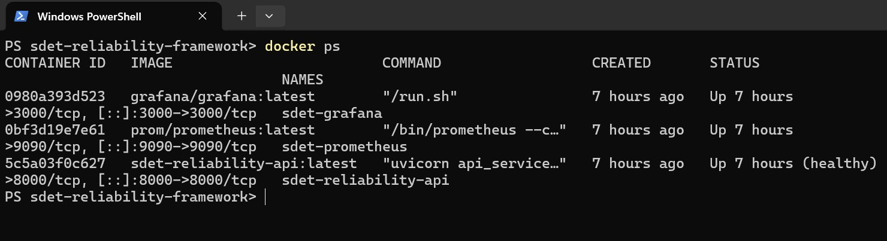
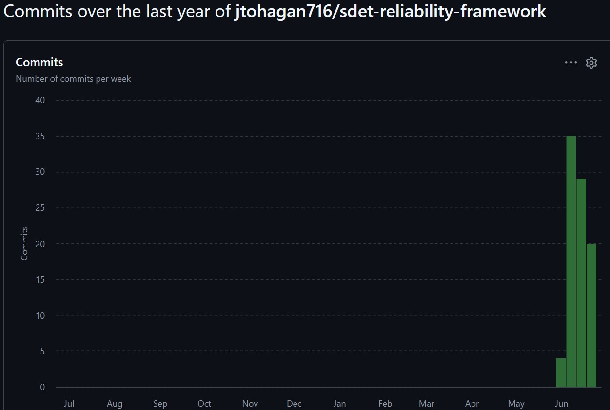
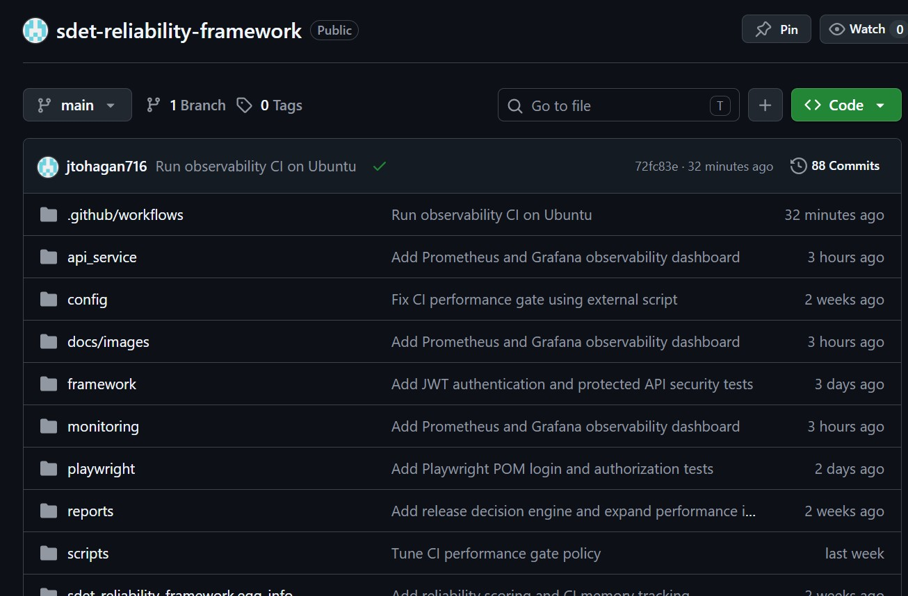
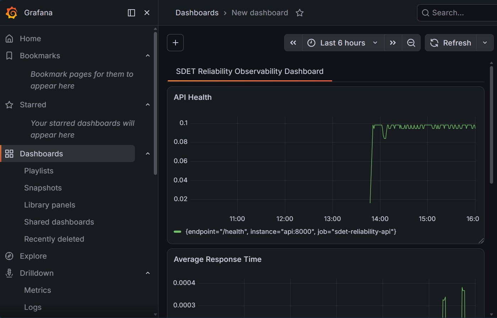
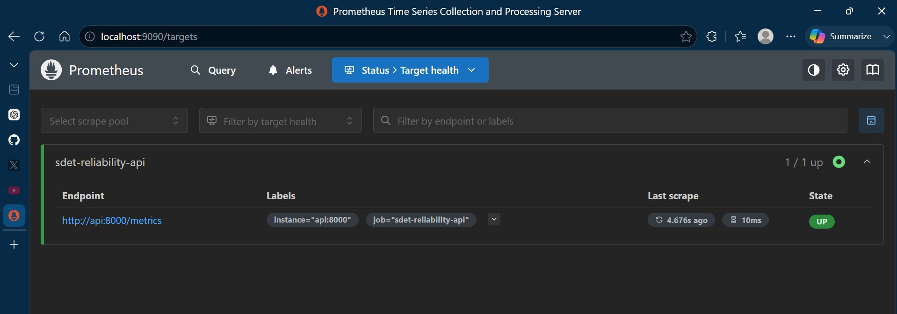

@'
# Visual Evidence

## Purpose

This document provides visual evidence that the SDET Reliability Framework is operational, observable, and actively maintained.

The screenshots below support the project’s core claim: the framework is not only documented, but running locally with containerized services, monitoring, dashboard visibility, and GitHub-based development history.

---

## Evidence Summary

| Evidence Area | Screenshot | What It Demonstrates |
|---|---|---|
| Docker runtime stack | Docker stack running | FastAPI, Prometheus, and Grafana are running locally |
| GitHub commit activity | Commit history | The repository shows active development and iteration |
| Repository structure | GitHub repository tree | The project is organized into source, docs, reports, scripts, monitoring, and workflows |
| Grafana dashboard | Observability dashboard | Runtime metrics are being visualized |
| Prometheus target health | Prometheus targets | Prometheus is successfully scraping the API metrics endpoint |

---

## Docker Stack Running



This screenshot shows the local Docker runtime stack.

Validated services include:

- `sdet-reliability-api`
- `sdet-prometheus`
- `sdet-grafana`

The API container is shown as healthy, confirming that the application service is running and passing its configured health check.

This supports local reproducibility and confirms that the reliability stack can be started and validated as a working system.

---

## GitHub Commit History



This screenshot shows repository activity over time.

The commit history demonstrates active development and ongoing iteration rather than a static or abandoned portfolio project.

This is useful evidence for hiring managers and technical reviewers because it shows consistent project work, incremental improvements, and continued investment in modern QA and reliability engineering skills.

---

## GitHub Repository Structure



This screenshot shows the repository structure on GitHub.

Visible areas include:

- `.github/workflows`
- `api_service`
- `docs/images`
- `framework`
- `monitoring`
- `playwright`
- `reports`
- `scripts`

This structure demonstrates that the project is organized around application code, automation, monitoring, reporting, documentation, and CI-related workflows.

---

## Grafana Observability Dashboard



This screenshot shows the Grafana dashboard for the SDET Reliability Framework.

The dashboard provides visual monitoring for runtime signals such as API health and response time.

This supports the project’s observability goal: quality decisions should be informed by runtime evidence, not only by test pass/fail results.

---

## Prometheus Target Health



This screenshot shows Prometheus target health.

The `sdet-reliability-api` target is shown as `UP`, with Prometheus scraping the `/metrics` endpoint from the API service.

This confirms that:

- The API exposes Prometheus-compatible metrics
- Prometheus can reach the API container
- Runtime observability data is available for dashboarding and release-readiness assessment

---

## Why This Evidence Matters

The screenshots demonstrate that the framework includes more than isolated automated tests.

They show a working quality and reliability stack with:

- Containerized execution
- API health validation
- Metrics export
- Prometheus scraping
- Grafana dashboard visualization
- Active GitHub development
- Organized repository structure

Together, this visual evidence supports the broader goal of the project:

```text
Test → Observe → Validate → Assess Risk → Recommend